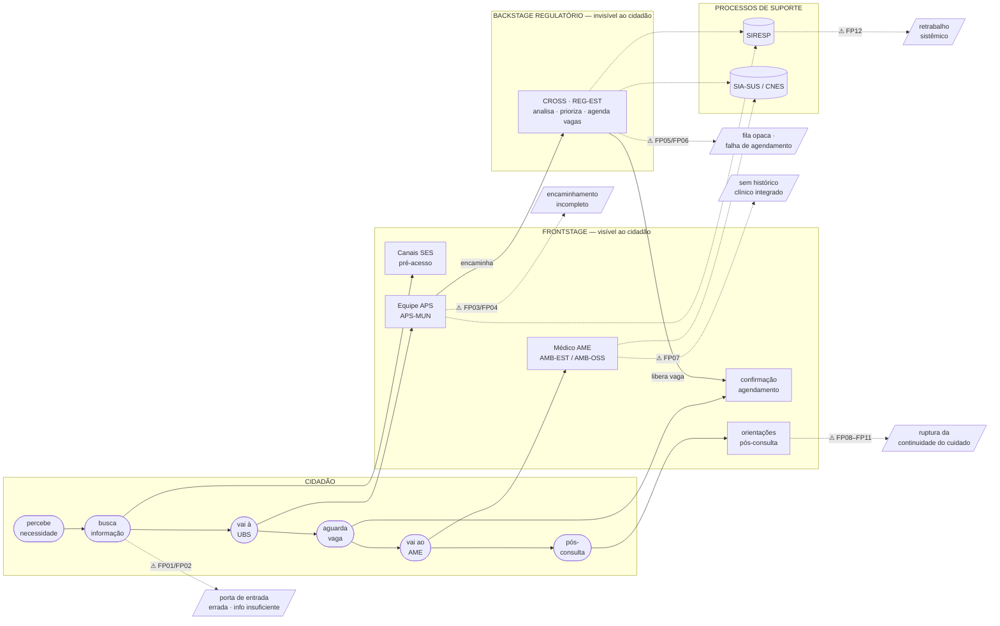
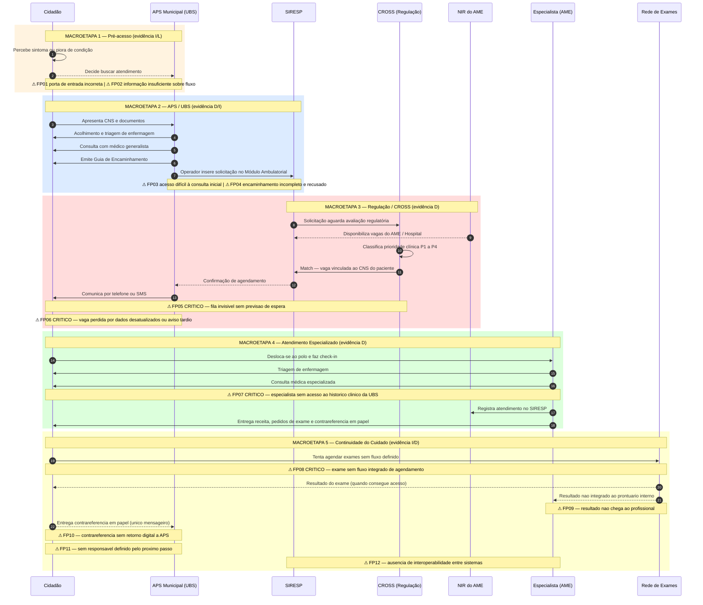
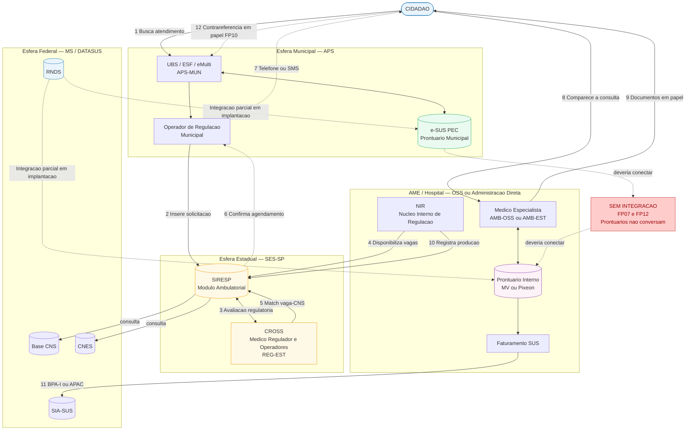
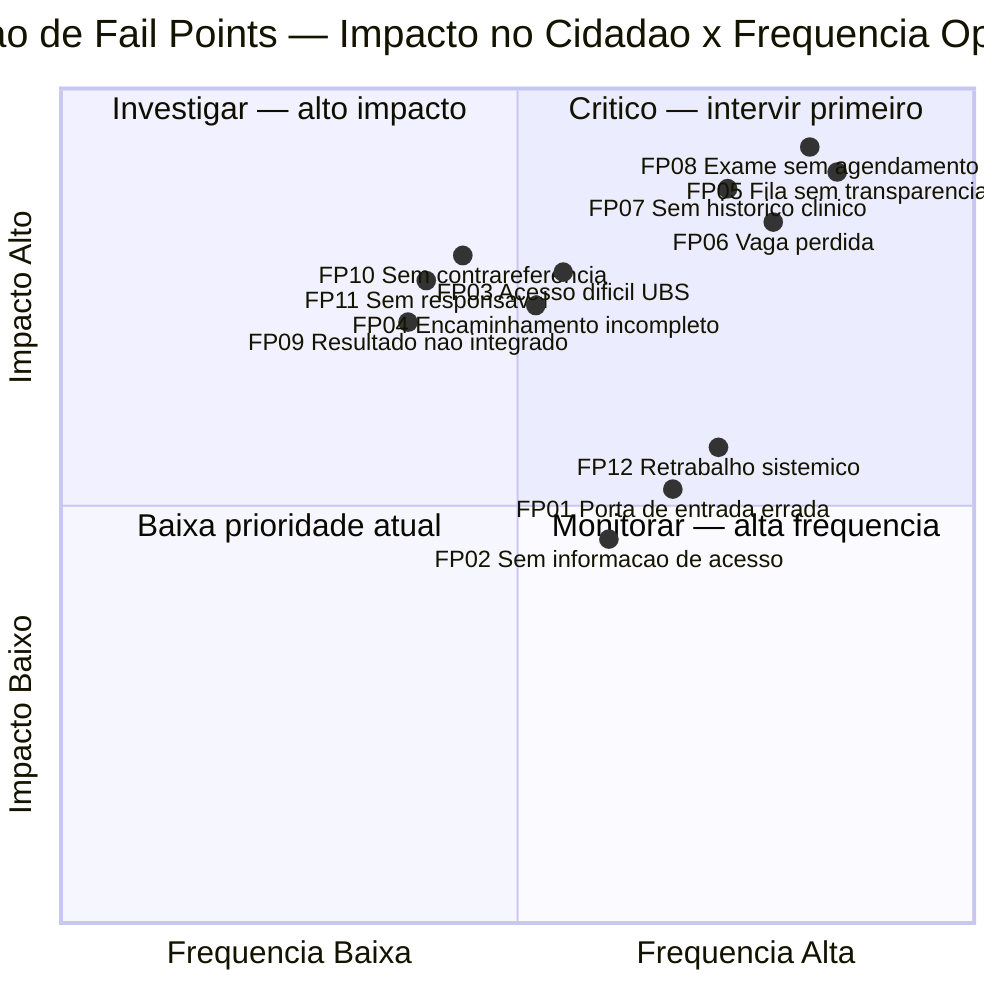

# Diagrama AS-IS — Relações entre Etapas e Atores
## Consulta Médica Especializada (Ambulatorial) — SES-SP

**Metodologia:** Service Blueprint AS-IS (Shostack, 1984)
**Renderização:** Mermaid v10+ (GitHub nativo)

---

## Diagrama Geral — Etapas, Atores e Fail Points

> Lê-se da esquerda para a direita seguindo a jornada do cidadão. As camadas agrupam: **Cidadão** → **Frontstage** (visível) → **Backstage Regulatório** (invisível, CROSS) → **Processos de Suporte**. As setas sólidas são fluxos principais; as tracejadas são consultas a sistemas ou fail points.

---

## Diagrama 1 — Sequência de Interações entre Atores

> Lê-se da esquerda para a direita, seguindo a progressão temporal da jornada do cidadão. Os retângulos coloridos agrupam as macroetapas. As anotações ⚠ indicam fail points no ponto exato em que ocorrem.

---

## Diagrama 2 — Arquitetura de Atores, Sistemas e Lacunas de Integração

> Mostra os atores por esfera institucional (federal, estadual, OSS/direta, municipal) e os sistemas que cada um opera. As setas tracejadas marcadas com `SEM INTEGRACAO` indicam conexões ausentes que são origem direta de fail points críticos.

---

## Diagrama 3 — Priorização de Fail Points por Impacto e Frequência

> Quadrante superior direito = intervencao imediata. Os quatro fail points criticos (FP05, FP06, FP07, FP08) estao concentrados nessa regiao e correspondem as quatro macrodiretrizes TO-BE do relatorio.

---

## Diagrama 4 — RACI Completo: Responsabilidade por Macroetapa e Ator

> **R** = Responsável pela execução | **A** = Accountable (responde pelos resultados) | **C** = Consultado (colabora com informações) | **I** = Informado (notificado do resultado)

```mermaid
%%{init: {"theme": "default"} }%%
graph LR
    subgraph RACI["RACI — Macroetapas x Atores"]
        direction TB
        H["Ator"]
        M1["ME1\nPré-acesso"]
        M2["ME2\nAPS / UBS"]
        M3["ME3\nRegulação"]
        M4["ME4\nAtendimento"]
        M5["ME5\nContinuidade"]

        CID["Cidadão (CID)"]
        APSMUN["APS-MUN\nUBS / ESF"]
        DRS["DRS\nDep. Regional"]
        CROSS["REG-EST\nCROSS"]
        NIR["NIR\nAME Interno"]
        AMB["AMB-OSS/EST\nEspecialista"]
        FAT["FAT\nFaturamento"]
        FED["SUP-FED\nFederal"]
    end

    CID -->|"R/A"| M1
    CID -->|"R"| M2
    CID -->|"I"| M3
    CID -->|"R"| M4
    CID -->|"R/A"| M5

    APSMUN -->|"I"| M1
    APSMUN -->|"R/A"| M2
    APSMUN -->|"R inserção e comunicação"| M3
    APSMUN -->|"C"| M4
    APSMUN -->|"R recebe contraref."| M5

    DRS -->|"—"| M1
    DRS -->|"C"| M2
    DRS -->|"A supervisão regional"| M3
    DRS -->|"I"| M4
    DRS -->|"A fiscalização"| M5

    CROSS -->|"—"| M1
    CROSS -->|"C"| M2
    CROSS -->|"R/A regulação e match"| M3
    CROSS -->|"I"| M4
    CROSS -->|"I"| M5

    NIR -->|"—"| M1
    NIR -->|"—"| M2
    NIR -->|"R disponibiliza vagas"| M3
    NIR -->|"R registra produção"| M4
    NIR -->|"C"| M5

    AMB -->|"—"| M1
    AMB -->|"—"| M2
    AMB -->|"I"| M3
    AMB -->|"R/A atendimento"| M4
    AMB -->|"R emite contraref."| M5

    FAT -->|"—"| M1
    FAT -->|"—"| M2
    FAT -->|"—"| M3
    FAT -->|"R faturamento e glosas"| M4
    FAT -->|"C"| M5

    FED -->|"C"| M1
    FED -->|"C"| M2
    FED -->|"C"| M3
    FED -->|"C"| M4
    FED -->|"C"| M5

    style CID fill:#e8f4fd,stroke:#2980b9
    style CROSS fill:#fef9e7,stroke:#f39c12
    style NIR fill:#fdf2f8,stroke:#8e44ad
    style DRS fill:#fff3e0,stroke:#e67e22
    style AMB fill:#eafaf1,stroke:#27ae60
    style FAT fill:#fdedec,stroke:#e74c3c
```

---

### Tabela RACI — Leitura Rápida

| Ator | ME1 Pré-acesso | ME2 APS / UBS | ME3 Regulação | ME4 Atendimento | ME5 Continuidade |
| :--- | :---: | :---: | :---: | :---: | :---: |
| **Cidadão (CID)** | **R/A** | **R** | I | **R** | **R/A** |
| **APS-MUN** | I | **R/A** | R (inserção/comunicação) | C | R (contrarreferência) |
| **DRS** | — | C | **A** (supervisão) | I | **A** (fiscalização) |
| **REG-EST (CROSS)** | — | C | **R/A** (regulação) | I | I |
| **NIR** | — | — | R (vagas) | R (produção) | C |
| **AMB-OSS / AMB-EST** | — | — | I | **R/A** (consulta) | R (contrarreferência) |
| **FAT** | — | — | — | R (faturamento) | C |
| **SUP-FED** | C | C | C | C | C |

> Fail points críticos concentram-se onde a **accountability (A) está ausente ou mal definida**: ME5 (continuidade) tem o cidadão como único R/A efetivo, revelando uma lacuna estrutural de governança.

---

## Legenda dos Diagramas

### Atores e esferas institucionais

| Código | Ator | Esfera |
| :--- | :--- | :--- |
| CID | Cidadão | — |
| APS-MUN | UBS / ESF / eMulti / Operador de Regulação Municipal | Municipal |
| REG-EST | CROSS — médico regulador e operadores | Estadual |
| NIR | Núcleo Interno de Regulação do AME ou Hospital | Estadual / Contratado |
| AMB-OSS | Especialista em AME gerido por OSS (Lei 9.637/1998) | Contratado |
| AMB-EST | Especialista em unidade de administração direta | Estadual |
| SUP-FED | DATASUS / RNDS / bases federais de saúde | Federal |

### Fail points — referência rápida

| ID | Macroetapa | Descrição resumida | Prioridade |
| :--- | :--- | :--- | :--- |
| FP01 | Pré-acesso | Porta de entrada incorreta | Média |
| FP02 | Pré-acesso | Sem informação sobre fluxo e documentos | Baixa/Média |
| FP03 | APS/UBS | Acesso difícil à consulta inicial na UBS | Alta |
| FP04 | APS/Regulação | Encaminhamento incompleto; recusado pela regulação | Alta |
| FP05 | Regulação | **Fila invisível — sem previsão de espera** | **Crítica** |
| FP06 | Regulação | **Vaga perdida por falha de comunicação** | **Crítica** |
| FP07 | Atendimento | **Especialista sem histórico clínico da UBS** | **Crítica** |
| FP08 | Pós-consulta | **Exame sem fluxo integrado de agendamento** | **Crítica** |
| FP09 | Pós-consulta | Resultado do exame não chega ao profissional | Média/Alta |
| FP10 | Contrarreferência | Contrarreferência sem retorno digital à APS | Alta |
| FP11 | Continuidade | Sem responsável definido pelo próximo passo | Alta |
| FP12 | Transversal | Retrabalho por ausência de interoperabilidade | Média |
